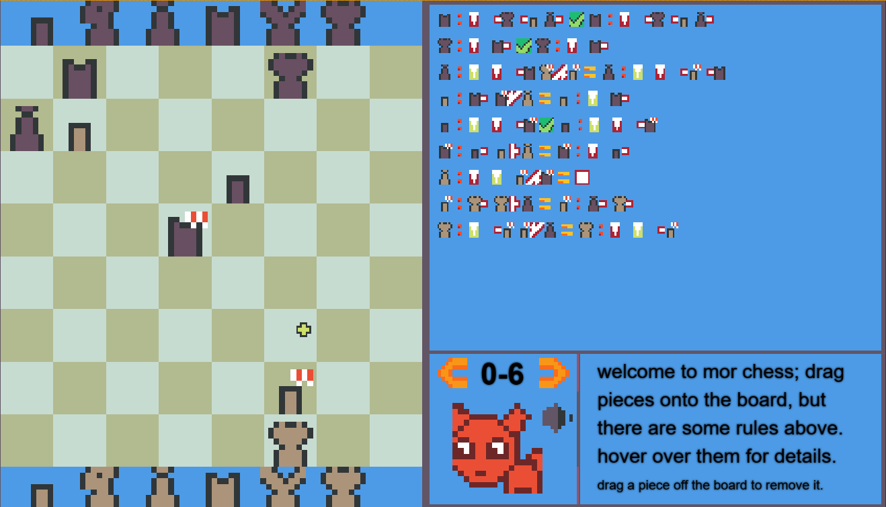

# Mor Chess




> A Chess Puzzle game about creating chess positions according to a few simple rules. 

A JS13k 2025 entry. Theme was "Black Cat", yet another grim theme.

I had a play with the colors this year, so I put an orange cat as a side character instead, but it can change colors to black if you solved the level or green if you revealed the solution.

And that's about it nothing fancy, in terms of code, graphics or audio. But, I decided to push limits in terms of compression, let's get into a little bit of details shall we.


## Graphics

I worked with standard CanvasRenderingContext2D API, especially the `drawImage` function but with a little twist. I split a 128x128 image atlas into sections of 4 32x32 areas, 24 16x16 areas, and rest 8x8 areas. In code, I made it so that I can call which section to draw by it's section index in the atlas, so I don't have to deal with coordinates. Whether it helped with compression or not, is debatable, but it definitely helps with ease of development.

In the end I had plenty of empty sections left, and I also had to delete some of them to fit the 13kbytes limit.

For text, I had a second canvas on top of the images with a 1920x1080 resolution, since the image canvas is 480x270 which makes rendering text very pixelated thus unacceptable. This also means I can't put images on top of the text, like the cursor image stays behind the text, not ideal but a compromise I am willing to take.


## Audio

Compression was my top priority, so I come up with the best effective results in terms of audio code usage.
For sounds fx I used the technique in [Infernal Sigil](https://github.com/arikwex/infernal-sigil), a previous JS13k entry by arikwex. It's really short and you draw your own sounds in code, using wave functions like `sin` `sqr` `saw`, or `random` with a specified duration.
For music I used [https://github.com/kevincennis/TinyMusic](https://github.com/kevincennis/TinyMusic), which is mentioned in the JS13k Website Resources page. Apart from being really small, it let's you specify notes and duration in text like this:

```
    'B4 h',
    'A4 q',
    'F#4 q',
```

Which is neat, because I preemptively composed a few sheet music in [MuseScore](https://musescore.org), specifically for Mor Chess, before the jam started.

It took a while to translate the notes into text, but it's very doable and easy, just takes a little bit of time, especially taking into the fact that I am not proficient with reading sheet music, with the notes in treble or bass cleff. I had a reference open on another tab to look at, and I had a lot of help from AI to compose the music for me. I mean I have a basic understanding of how music works, but have basically zero experience about notes, keys or scales. I don't even play any instruments. Nevertheless, I have some decent 8 bit sounding music that doesn't hurt ears at first hear.

## Game Design

I have an ongoing research on how to effectively translate chess tactics into some sort of a formal language so that it can be described precisely and be understood when read as text. Some kind of educational chess tool, that can also be used to generate tactics that have the same ideas and structure, or spot tactics when given any position. It's in rough shape in terms of progress but I have some [demonstration page](https://eguneys.github.io/tactics-filter-2002-26/), with zero documentation, if you want to check out [the code](https://github.com/eguneys/hopefox/blob/main/test/mor_gen6.test.ts), there are some tests that sort of reveal how it works. It keeps me excited but I am basically stuck at some point, by the sheer complexity nature of chess.


I also have aims to flex these ideas into creating a more informal type of chess puzzle game, or playing a more abstract form of chess. That's where Mor Chess comes from.


## Misc

I would have liked to remove this line of code in `package.json` and integrate that into [vite](https://vite.dev/) build process. `"zip": "cd tools && optipng.exe -o7 ../dist/assets/*.png && cd ../dist && 7z a ../dist.zip -mx9 && cd .. && cd tools && advzip.exe --recompress --shrink-extra ../dist.zip",`, so that each time I run build, I can immediately see the zipped build size in total.


And That's it, I have been submitting games to JS13k each year since 2019, only get to 60'ies once and got a T-Shirt. Hopefully this year will be in my luck.